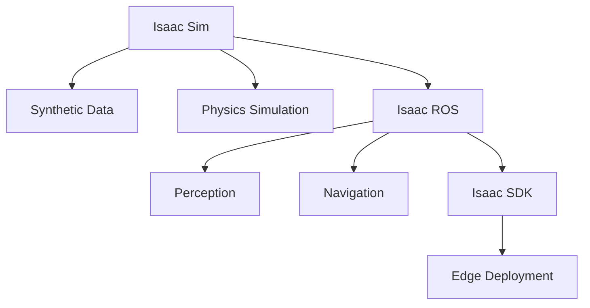

# NVIDIA Isaac Platform

## Learning Outcomes
By the end of this chapter, you should be able to:
- Understand the NVIDIA Isaac ecosystem
- Set up Isaac Sim for robot simulation
- Use Isaac ROS for hardware-accelerated perception
- Implement basic navigation with Nav2

## Introduction to NVIDIA Isaac

NVIDIA Isaac is a comprehensive platform for developing and deploying AI-powered robots. It provides tools for simulation, perception, and deployment that leverage NVIDIA's GPU acceleration.

### The Isaac Ecosystem



## Isaac Sim

Isaac Sim is built on NVIDIA Omniverse and provides photorealistic simulation for robotics.

### Key Features

1. **Photorealistic Rendering**: Ray-traced graphics for realistic sensor simulation
2. **Synthetic Data Generation**: Create training data for AI models
3. **Domain Randomization**: Improve model robustness
4. **ROS 2 Bridge**: Direct integration with ROS 2

### System Requirements

:::danger Hardware Requirements
Isaac Sim requires an NVIDIA RTX GPU with at least 8GB VRAM. RTX 3080 or higher is recommended for smooth operation.
:::

```bash
# Check GPU compatibility
nvidia-smi

# Minimum requirements:
# - NVIDIA RTX 2070 or higher
# - 32GB RAM
# - Ubuntu 22.04
```

## Isaac ROS

Isaac ROS provides GPU-accelerated ROS 2 packages for perception and navigation.

### VSLAM (Visual SLAM)

Visual Simultaneous Localization and Mapping using stereo cameras:

```python
# Example: Launching Isaac ROS VSLAM
# ros2 launch isaac_ros_visual_slam isaac_ros_visual_slam.launch.py

# Key topics:
# /visual_slam/tracking/odometry - Robot pose
# /visual_slam/vis/landmarks_cloud - 3D landmarks
```

### Hardware Acceleration

Isaac ROS uses NVIDIA's hardware acceleration:

| Component | Acceleration |
|-----------|-------------|
| Image Processing | CUDA |
| DNN Inference | TensorRT |
| Stereo Matching | VPI |
| SLAM | cuVSLAM |

## Nav2 for Humanoid Robots

Nav2 (Navigation 2) is the ROS 2 navigation stack, essential for autonomous robot movement.

### Path Planning

```python
# Example: Sending a navigation goal
from geometry_msgs.msg import PoseStamped
from nav2_simple_commander.robot_navigator import BasicNavigator

navigator = BasicNavigator()

goal_pose = PoseStamped()
goal_pose.header.frame_id = 'map'
goal_pose.pose.position.x = 2.0
goal_pose.pose.position.y = 1.0

navigator.goToPose(goal_pose)
```

:::tip Bipedal Navigation
For humanoid robots, Nav2 requires custom locomotion controllers that account for balance and gait planning.
:::

## Assessments

1. Explain the relationship between Isaac Sim, Isaac ROS, and Isaac SDK.
2. What are the advantages of using GPU-accelerated perception in robotics?
3. Describe how synthetic data generation in Isaac Sim can improve real-world robot performance.
4. What modifications would Nav2 require for a bipedal humanoid robot compared to a wheeled robot?
